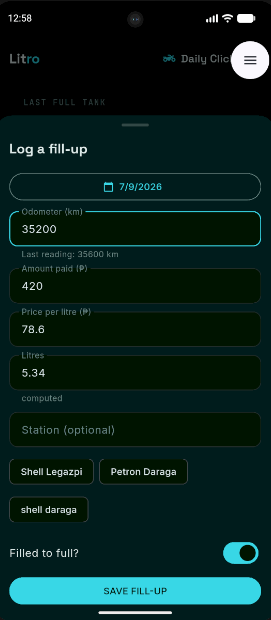
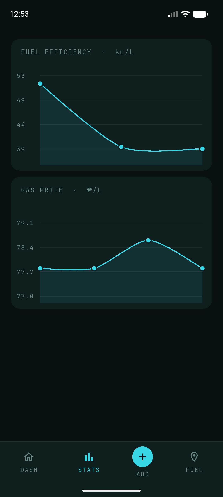
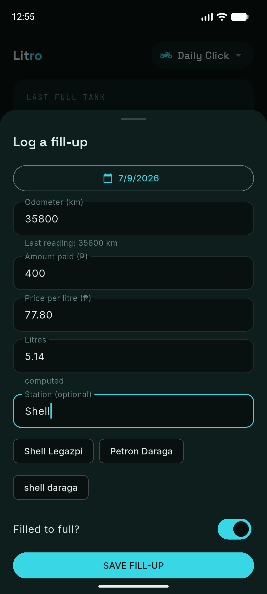

# Litro

**A motorcycle fuel and maintenance tracker for daily riders.** Log a fill-up in about ten
seconds; Litro works out what your bike actually drinks, what it costs you per kilometre,
and when its next service is due.

I built it to track my own Honda Click — the numbers on a spec sheet never match what you
get in Legazpi traffic, and I wanted to know the real one.

<p align="center">
  
  
  
</p>

---

## What it does

- **Measures real fuel efficiency** between full tanks, not from the manufacturer's claim
- **Any two of {litres, price/L, amount paid}** computes the third while you type
- **Tracks maintenance** — oil, chain, brakes, anything on a schedule, by distance or by time
- **Compares stations** by the price you actually paid, cheapest highlighted
- **Charts** efficiency and gas-price trends over time
- **Handles multiple bikes**, with every number scoped to the one you're riding
- **Works with no signal.** No account, no server, nothing to sign up for

---

## Why it's built this way

### Offline-first, with no backend

Everything lives in SQLite on the phone. That isn't a shortcut — it's the requirement.
You log a fill-up standing at a pump, which is exactly where signal is worst. No account
means no login screen, no password reset, and no holding anyone else's data.

The trade-off is real and stated: without a cloud, a lost phone is a lost history. Export
is the answer, not a server.

### The efficiency calculation is the actual product

Fuel efficiency can only be measured **between two full tanks** — if both ends are full,
whatever is in the tank cancels out and the fuel burned is everything added in between.

The subtle part is an off-by-one: the petrol bought at the *first* full tank was already in
the tank when the measurement started, so it doesn't count toward the distance travelled
after it. Including it understates efficiency by a third on a short history.

That logic lives in [`lib/domain/`](lib/domain/) as pure functions over
`List<FuelEntry>` — no widgets, no database — and it's the part that's unit-tested. Every
edge case is a named test: a first entry with nothing to measure from, a full tank with no
prior full tank, partial top-ups in between, an odometer that never moved.

### The UI is a function of the database

Every screen reads a Drift `Stream`. Insert a fill-up and the hero number, the lifetime
average, the cost per kilometre, the charts and the recent-fills list all recompute
themselves — there is no refresh call anywhere in the app, and nothing is cached.

Deleting an entry recomputes the tanks around it for the same reason.

### Migrations carry data, they don't reset it

The schema has been through three versions. The v2 → v3 migration created a
`maintenance_items` table **and walked every existing bike**, turning its three oil-change
columns into a real maintenance row. Nobody lost their tracking.

That matters more than usual here: there's no server, so a migration that silently wipes
someone's history is unrecoverable and invisible.

### Nothing invented

A number that can't be computed renders as `—`, never `0.0`. One fill-up genuinely cannot
produce a km/L figure, and a dashboard reading `0.0 km/L` looks broken rather than empty.
Comparison lines hide entirely when the bike has no manufacturer figure to compare against.

---

## Built with

| | |
|---|---|
| **Flutter 3.47 / Dart 3.13** | |
| **[Drift](https://drift.simonbinder.eu/)** | typed SQLite, reactive queries, schema migrations |
| **[fl_chart](https://pub.dev/packages/fl_chart)** | efficiency and price trends |
| **[intl](https://pub.dev/packages/intl)** | `en_PH` peso and date formatting |
| `CustomPainter` | the arc gauge and the coach-mark spotlight, drawn by hand |

State is plain `setState` and `StreamBuilder`. The database is the single source of truth,
so there is very little UI state to manage — a tab index and a page index.

---

## Running it

```bash
flutter pub get
dart run build_runner build      # generates the Drift code
flutter run
```

Tests:

```bash
flutter test
```

---

## Project layout

```
lib/
  data/        Drift schema, tables, migrations
  domain/      pure calculations — efficiency, maintenance due dates
  screens/     one file per screen or sheet
  theme/       colour tokens and ThemeData
  widgets/     shared presentation widgets
test/          domain and database tests
```

---

## Roadmap

- [ ] Export and import your data as a file — the missing piece for a phone you might lose
- [ ] Notifications when maintenance is close, using average km/day to predict the date
- [ ] Preset list of common PH models to pre-fill tank size and service intervals
- [ ] GPS-tagged stations on a map, cheapest highlighted
